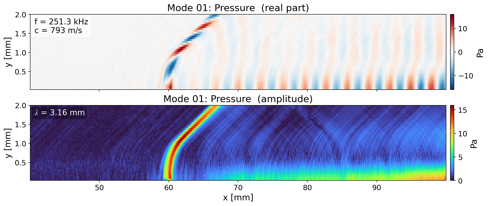
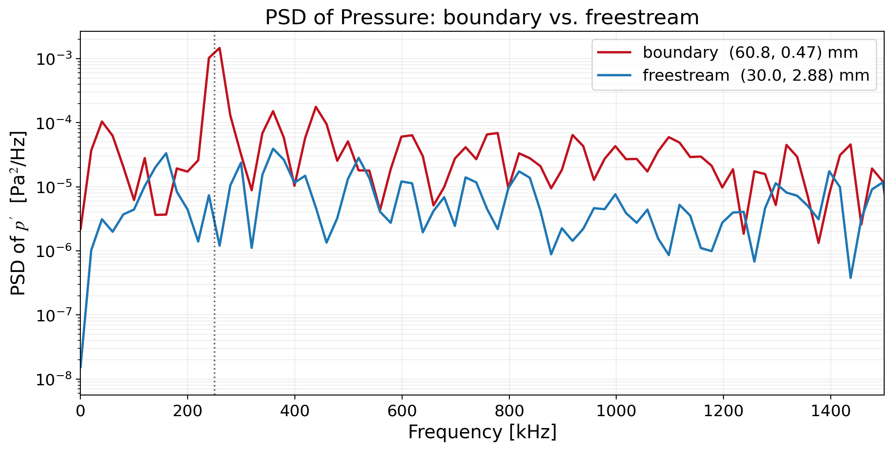
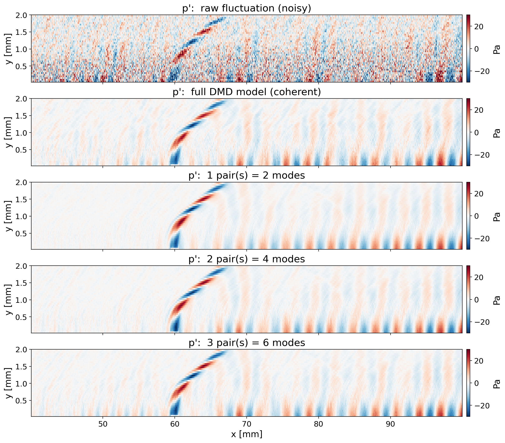

# Example: hypersonic flow over a flat plate

This is a complete worked example for the toolkit. It contains the data for one
case and all of the analysis results produced from it, so you can browse the
outputs here directly or regenerate them yourself.

## The case

A Direct Simulation Monte Carlo (DSMC) run of a Mach 6 nitrogen flow over a flat
plate. A short patch of the wall, from x = 59.5 to 60.5 mm, oscillates with
periodic blowing and suction at 250 kHz. It acts as an actuator that excites a
travelling second-mode (Mack mode) instability wave in the boundary layer.
Because the forcing frequency is known, this is an ideal test: the analysis
should recover a wave right at 250 kHz.

The data in `data/` is a trimmed, dimensionalized excerpt of the converged tail
of that run.

| Property | Value |
|----------|-------|
| Fields | number density (m⁻³) and pressure (Pa) |
| Array shape | (501, 60, 2402) = (time, y, x) |
| Domain | x from 0 to 120 mm, y from 0 to 3 mm |
| Snapshots | 501, from steps 750000 to 800000, kept every second frame |
| Timestep | dt = 1e-7 s, so fs = 10 MHz and Nyquist = 5 MHz |
| Forcing | wall actuator at x = 59.5 to 60.5 mm, 250 kHz, Vn = 100 m/s |

## How the results are organized

```
results/
├── 00_inspect/         data report, time-mean and fluctuation maps
├── 01_animation/       movies of each field and its fluctuation
├── 02_rms/             RMS fluctuation maps and a summary table
├── 03_psd/             boundary vs. freestream spectra and tables
├── 04_dmd/
│   ├── pressure/       SVD, spectrum, mode maps, mode .npz, summary CSV, metadata
│   └── number_density/ the same set for number density
└── 05_reconstruction/
    └── pressure/       reconstruction from a few modes, convergence, movies
```

## What the analysis finds

The pressure DMD recovers a dominant mode at 251 kHz, right on the forcing
frequency, with a phase speed of about 793 m/s and a streamwise wavelength of
about 3.2 mm. The mode clearly emanates from the actuator near x = 60 mm and
grows downstream.



The number density DMD is dominated instead by a 349.5 kHz mode, with 252 kHz a
close second, which matches the production analysis of this case.

The point spectra show the contrast that motivates the whole study. The boundary
probe has a sharp tone at the forcing frequency, while the freestream probe is a
flat broadband floor, which here is DSMC statistical scatter.



Reconstructing the pressure field from only the first few conjugate mode-pairs
already reproduces the travelling wave. The raw fluctuation is noisy because most
of the instantaneous fluctuation energy in DSMC is incoherent noise (the coherent
fraction here is about 0.45), so the reconstruction is best read as the coherent
wave extracted from that noise.



## Regenerating these results

The scripts default to this example, so from the repository root you can simply
run:

```bash
python run_all.py
```

or run any single step, for example:

```bash
python scripts/04_dmd_analysis.py --field pressure --x-min-mm 40 --x-max-mm 100 --y-max-mm 2.5
python scripts/05_reconstruct_from_modes.py --field pressure --pairs 3 \
       --x-min-mm 40 --x-max-mm 100 --y-max-mm 2.5
```

Everything writes back into `results/`.
